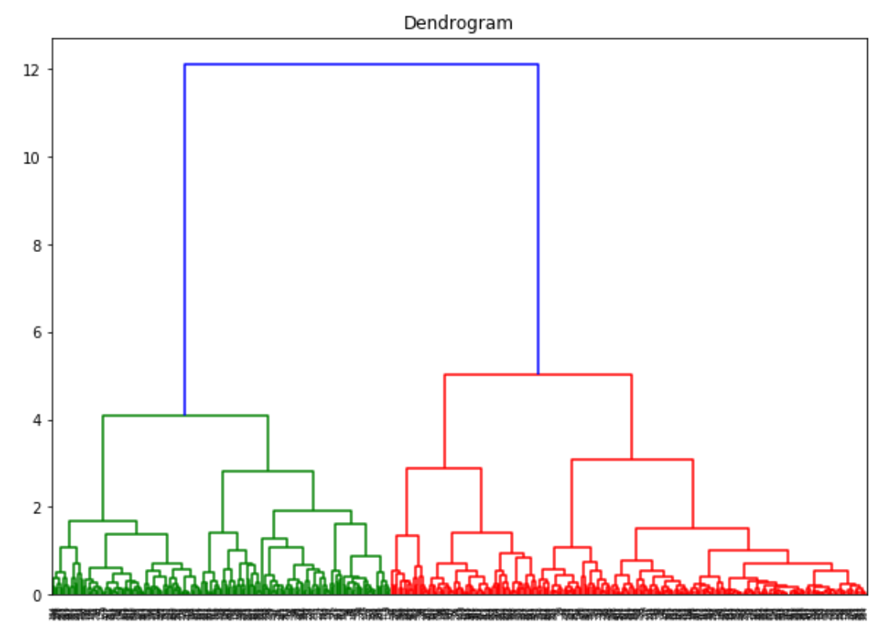
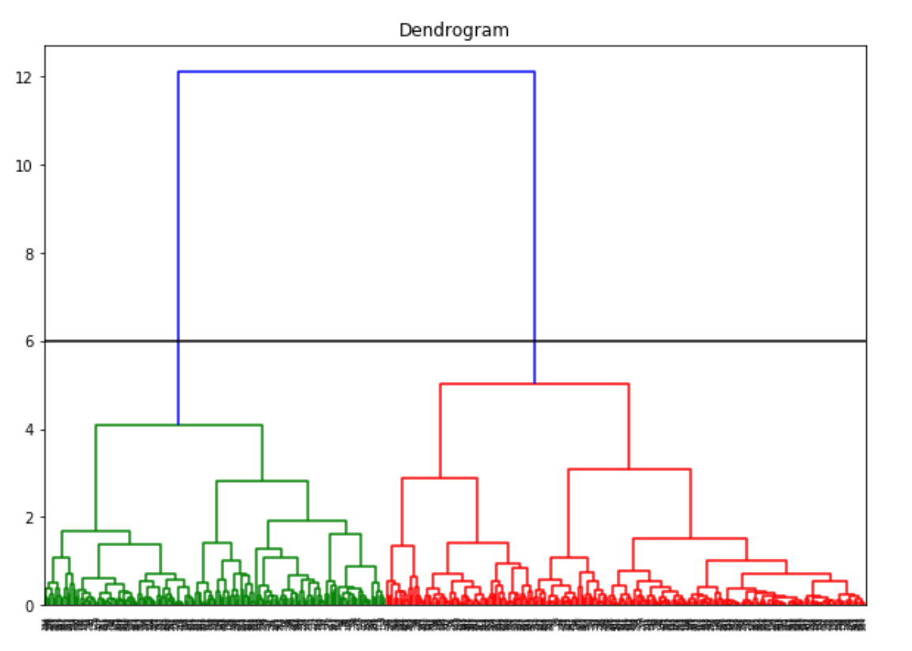
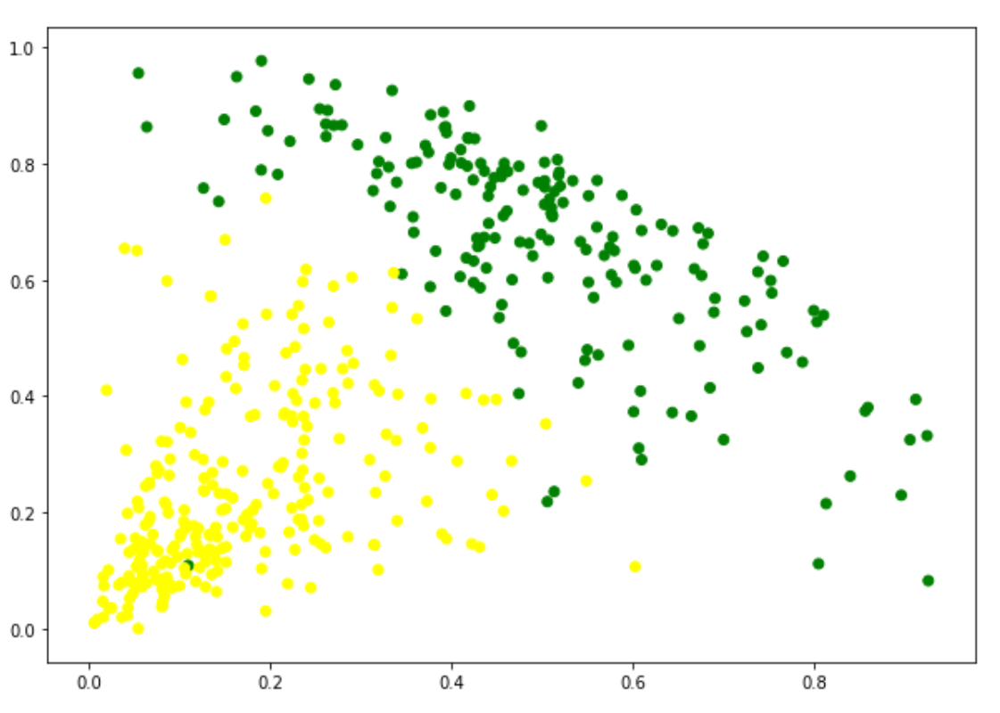

# Agglomerative Hierarchical Clustering

This technique is a bottom up approach in which each datapoint is considered to be an individual cluster. In each iteration the similar clusters merge with other clusters to form either one cluster or K clusters.

# Working

We implement this technique on a wholesale customers database with the aim to segment the clients of a wholesale distributor on the basis of their annual spending on different product categories like milk, groceries etc.
* Import the dataset
* Use dendrogram to find the number of clusters

* Fit agglomerative hierarchical clustering to the Wholesale Customers dataset
* Visualization

